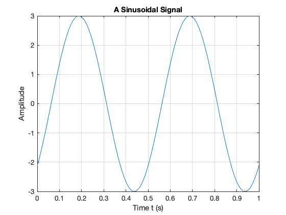
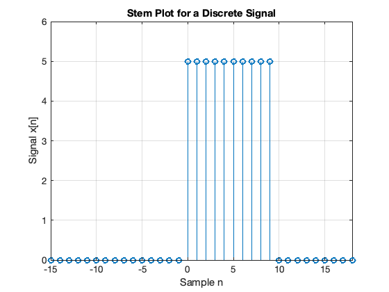
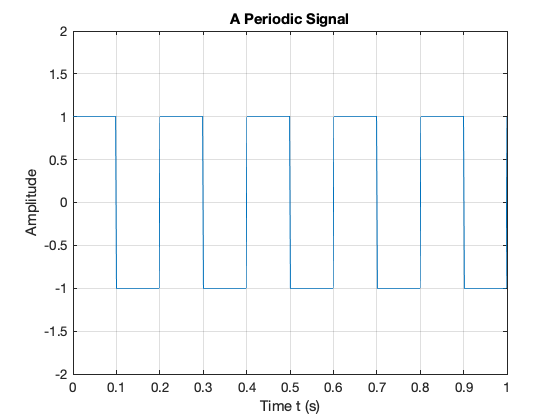
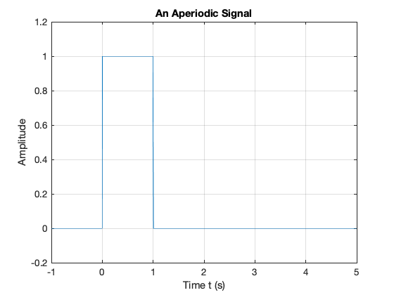

---
redirect_from:
  - "/"
interact_link: content/introduction/index.ipynb
title: 'Introduction'
prev_page:
  url: 
  title: ''
next_page:
  url: /elementary_signals/index
  title: 'Elementary Signals'
comment: "***PROGRAMMATICALLY GENERATED, DO NOT EDIT. SEE ORIGINAL FILES IN /content***"
---

# Introducing Signals and Systems

## Signals and Systems for Dummies

Signals and Systems for Dummies (**SS4D**) provides a useful introduction to the topics that will be covered in this module and it is in the Reading List as a *recommended text*. I have based this presentation on Chapter 1 which is available as a [downloadable PDF](http://eu.dummies.com/store/product/Signals-and-Systems-For-Dummies.productCd-111847581X.html) from the publishers.

You should read Chapter 1 of SS4D in conjunction with the notes for this presentation.

An annotatable copy of the full notes for this presentation will be distributed before the first class meeting as **Worksheet 1** the handouts section for week 1 of the *_Content Library* of the **OneNote Class Notebook**. You can also view the notes for this presentation as a webpage ([HTML](https://cpjobling.github.io/eg-247-textbook/introduction/index.html)) and as a downloadable [PDF file](https://cpjobling.github.io/eg-247-textbook/introduction/introduction.pdf).


Note that Signals and Systems for Dummies is available as an e-book from the [Bay Library](http://whel-primo.hosted.exlibrisgroup.com/44WHELF_SWA_VU1:LSCOP_44WHELF_SWA_ALMA_DS:44WHELF_SWA_ALMA_DS5177422270002417).

## Agenda

* Continuous-time signals
* Continuous-time systems
* Discrete-time signals
* Discrete-time systems
* Signal Classifications
* Domains for Signals
* Systems Thinking and Systems Design

## Continuous-time signals

Continuous signals are represented mathematically by functions which vary continuously with time.


Sinusoidal signals (e.g. AC) are pretty fundamental in electrical engineering. The mathematical model of a sinusoidal signal is:

$$x(t) = A \cos (2\pi f_0 t - \phi).$$ 

For this expression, we wish to match each of the symbols to its definition

| Symbol     | Definition         |
|------------|--------------------|
| $A$        | Phase in radians   |
| $f_0$      | Frequency in Hz    |
| $\phi$     | Amplitude          |
| $2\pi f_0$ | Frequency in rad/s |

### Gaining insight using computers

To help us answer these questions, let's use our Mathematical tools to plot a signal like this and explore it. The example we will use is from *Signals and Systems for Dummies* (SS4D: page 12): 

$$3\cos(2\pi\cdot 2t - 3\pi/4)$$

#### Wolfram Alpha

Here's the link: <http://www.wolframalpha.com>

Paste this into the search box

    plot 3 cos(2 pi 2 t - 3 pi/4) 


#### Matlab

In Matlab we would need to tackle this by breaking down the steps.


{:.input_area}
```matlab
%Make sure that we have a clean workspace
clear all
format compact
```


Define `t`


{:.input_area}
```matlab
t = linspace(0, 1, 100);
```


Define `x`


{:.input_area}
```matlab
x = 3 * cos(2*pi*2*t - 3*pi/4);
```


Plot result and label plot


{:.input_area}
```matlab
plot(t,x)
title('A Sinusoidal Signal')
xlabel('Time t (s)')
ylabel('Amplitude')
grid
```


{:.output .output_png}



If you want to execute this in MATLAB, you can create a file.


{:.input_area}
```matlab
%%file sinewave.m
% SINEWAVE - plot function $x(t) = 3 \cos(2\pi t - 3 \pi/4)$ for $t = 0\ldots 1$

%% Set up the problem
% define t
t = linspace(0, 1, 100);
% define x
x = 3 * cos(2*pi*2*t - 3*pi/4);
%% Plot result and label plot
plot(t,x)
title('A Sinusoidal Signal')
xlabel('Time t (s)')
ylabel('Amplitude')
grid
```


{:.output .output_stream}
```
Created file '/Users/eechris/dev/eg-247-textbook/content/introduction/sinewave.m'.

```

To run this script, just type the filename withount the `.m` extension


{:.input_area}
```matlab
sinewave
```


{:.output .output_png}


### Returning to the Question

Sinusoidal signals (e.g. AC) are pretty fundamental in electrical engineering. The mathematical model of a sinusoidal signal is:

$$x(t) = A \cos (2\pi f_0 t - \phi).$$ 

Using the insight just gained by exploring this function with a computer, try matching each of the symbols to its definition again.

| Symbol     | Definition         |
|------------|--------------------|
| $A$        | Phase in radians   |
| $f_0$      | Frequency in Hz    |
| $\phi$     | Amplitude          |
| $2\pi f_0$ | Frequency in rad/s |

### Supplementary question

What is the period of the waveform in seconds?

1. $2\pi$
1. $f_0$
1. $t$
1. $1/f_0$
1. $2\pi/f_0$

**Notes**

* In communications and electronic signal processing, the frequency of sinusoidal signals us usually given in *cycles per second* or Hz. 
* In mathematics, the frequency is always expressed in *radians per second*. 
* In some courses, including later in this one and in EG-243 Control Systems, the frequency $2\pi f_0$ is often called the *natural frequency* and is usually written $\omega_n$.

### Try This Yourself

* Use any or all of computing tools that you have access to to explore other sinusoids. Change the values of the variables and explain what happens. 
* Try adding sinusoids of different amplitudes and different frequencies together and see what happens.
* Change `cos` to `sin` and see what happens.


## Continuous-time Systems

Systems operate on signals. In mathematical terms, a *system* is a function or an *operator*, $H\{\}$ that maps the input signal $x(t)$ to an output signal $y(t)$. 

Mathematically we would write this:

$$y(t) = H\{x(t)\}.$$

### Example

An example of a continuous-time system is an electronic amplifier with a gain of 5 and level shift of 2: $y(t) = H\{x(t)\} = 5x(t) + 2$.

In this course, we will model such systems as block diagram models in Simulink.

#### Block diagram model in Simulink


The Similink code can be downloaded from this file [gain_level_shift.slx](gain_level_shift.slx).

## Discrete-time Signals

Disrete-time signals are a function of a time index $n$. A discrete-time signal $x[n]$, unlike a continuous-time signal $x(t)$, is only defined at integer values of the independent variable $n$. This means that the signal is only active at specific periods of time. Discrete-time signals can be stored in computer memory.

### Example

Consider the following simple signal, a pulse sequence:$$y[n] = \left\{ {\begin{array}{*{20}{c}}
{5,\;0 \le n < 10}\\
{0,\;{\rm{otherwise}}\quad \;}
\end{array}} \right.$$
We can plot this in Matlab as a *stem plot*

#### Procedure

Define function and save as [y.m](y.m).


{:.input_area}
```matlab
%%file y.m
% Define the function
function [ y ] = x( n )
  if n < 0 | n >= 10 
      y = 0;
  else 
      y = 5;
  end
end
```


{:.output .output_stream}
```
Created file '/Users/eechris/dev/eg-247-textbook/content/introduction/y.m'.

```


{:.input_area}
```matlab
open y
```


{:.input_area}
```matlab
%% Define sample points
n = -15:18;
%% Make space for the signal
xn = zeros(size(n));
```


{:.input_area}
```matlab
%% Compute the signal x[n]
for i = 1:length(xn)
    xn(i) = y(n(i));
end
```


{:.input_area}
```matlab
%% Plot the result
stem(n,xn)
axis([-15, 18, 0, 6])
title('Stem Plot for a Discrete Signal')
xlabel('Sample n')
ylabel('Signal x[n]')
grid
```


{:.output .output_png}



## Discrete-time Systems

A discrete-time system, like its continuous-time counterpart, is a function, $H\{\}$, that maps the input $x[n]$ to the output $y[n] = H\{x[n]\}$. An example of a discrete-time system is the *two-tap* filter:

$$y[n] = H\{x[n]\} = \frac{3}{4}x[n] + \frac{1}{4}x[n-1]$$

The term *tap* denotes that output at time instant $n$ is formed from two time instants of the input, $n$ and $n – 1$. Check out a block diagram of a two-tap filter system:


This system is available as a Simulink model [discrete_system.slx](discrete_system.slx)

In words, this system scales the present input by 3/4 and adds it to the past value of the input scaled by 1/4. The notion of the past input comes about because $x[n - 1]$ is lagging one sample value behind $x[n]$. The term *filter* describes the output as an *averaging* of the present input and the previous input. *Averaging* is a form of filtering.

## Signal Classifications

### Periodic

Signals that repeat over and over are said to be *periodic*. In mathematical terms, a signal is periodic if:

* *Continuous signal* $x(t + T) = x(t)$
* *Discrete signal* $x[n + N] = x[n]$

The smallest $T$ or $N$ for which the equality holds is the *signal period*.

The sinusoidal signal we saw earlier is periodic because of the $\mod 2\pi$ property of cosines. The signal of the sinusoid has period 0.5 seconds (s), which turns out to be the reciprocal of the frequency  $1/f_0$  Hz.

#### Square Wave

This code generates a square wave.


{:.input_area}
```matlab
%% A Periodic signal (square wave)
t = linspace(0, 1, 500);
x = square(2 * pi * 5 * t);

```


This Square wave is a 5 Hz waveform sampled at 500 Hz for 1 second


{:.input_area}
```matlab
plot(t, x);
ylim([-2, 2]);
grid()
title('A Periodic Signal')
xlabel('Time t (s)')
ylabel('Amplitude')
```


{:.output .output_png}



What is the period $T$ in milliseconds?

### Aperiodic

Signals that are *deterministic* (completely determined functions of time) but not periodic are known as *aperiodic*. Point of view matters. If a signal occurs infrequently, you may view it as aperiodic. 

This is how we generate an aperiodic rectangular pulse of duration $\tau$ in Matlab:


{:.input_area}
```matlab
%% An aperiodic function
tau = 1;
x = linspace(-1,5,1000);
y = rectangularPulse(0,tau,x);
```


{:.input_area}
```matlab
plot(x,y)
ylim([-0.2,1.2])
grid
title('An Aperiodic Signal')
xlabel('Time t (s)')
ylabel('Amplitude')
```


{:.output .output_png}



### Random

A signal is random if one or more signal attributes takes on unpredictable
values in a probability sense.

Engineers working with communication receivers are concerned with random
signals, especially noise.


{:.input_area}
```matlab
%% Plot a Random Signal
plot(0.5 + 0.25 * rand(100,1))
ylim([0,1])
grid
title('Random Signal')
xlabel('Time t (s)')
ylabel('Amplitude')
```


{:.output .output_png}


## Domains for Signals and Systems

Most of the signals we encounter on a daily basis reside in the time domain. They’re functions of independent variable $t$ or $n$. But sometimes when you’re working with continuous-time signals, you may need to transform away from the time domain ($t$) to another domain.

### Other Domains you will encounter

The most commonly used domains used when analysing continuous time signals are the frequency domain ($f$ or $\omega$) and the Laplace $s$-domain ($s$). 

Similarly, for discrete-time signals, you may need to transform from the discrete-time domain ($n$) to the frequency domain ($\hat{\omega}$) or the z-domain ($z$).


This section briefly introduces the world of signals and systems in the frequency, s-, and z-domains. More on these domains will follow.

Systems, continuous and discrete, can also be transformed to the frequency and s- and z-domains, respectively. Signals can, in fact, be passed through systems in these alternative domains. When a signal is passed through a system in the frequency domain, for example, the frequency domain output signal can later be returned to the time domain and appear just as if the time- domain version of the system operated on the signal in the time domain.


Consider the sum of a two-sinusoids signal
$$x(t) = \underbrace {A_1\cos(2\pi f_1 t)}_{s_1} + \underbrace {A_2\cos(2\pi f_2 t)}_{s_2}$$


{:.input_area}
```matlab
%%file two_sines.m
%... plot two sinusoids signal
A1 = 2; f1 = 1;
A2 = 1.5;f2 = 2.2;
t = linspace(0, 3*(1/f1), 1000);
s1 = A1*cos(2*pi*f1*t);
s2 = A2*cos(2*pi*f2*t);
subplot(4,1,1)
plot(t,s1),ylim([-5,5]),xlabel('Time t (s) '),ylabel('s1')
subplot(4,1,2)
plot(t,s2),ylim([-5,5]),xlabel('Time t (s) '),ylabel('s2')
subplot(4,1,3)
plot(t,s1+s2),ylim([-5,5]),xlabel('Time t (s) '),ylabel('x(t) = s2 + s2')
subplot(4,1,4)
axis([0,4,0,2.5])
arrow([f1,0],[f1,A1]),text(f1,A1+0.2,'A1'),text(f1+0.05,0.2,'f1')
arrow([f2,0],[f2,A2]),text(f2,A2+0.2,'A2'),text(f2+0.05,0.2,'f2')
ylabel('Frequency Spectrum X(f)'),xlabel('Frequency (Hz)')
```


{:.output .output_stream}
```
Created file '/Users/eechris/dev/eg-247-textbook/content/introduction/two_sines.m'.

```


{:.input_area}
```matlab
two_sines
```


{:.output .output_png}


### Viewing Signals in the Frequency Domain

The top waveform plot, denoted $s_1$, is a single sinusoid at frequency $f_1$ and peak amplitude $A_1$. The waveform repeats every period $T_1 = 1/f_1$. The second waveform plot, denoted $s_2$, is a single sinusoid at frequency $f_2 > f_1$ and peak amplitude $A_2 < A_1$. The sum signal, $s_1 + s_2$, in the time domain is a squiggly line (third waveform plot), but the amplitudes and frequencies (periods) of the sinusoids aren’t clear here as they are in the first two plots. The frequency spectrum (bottom plot) reveals that $x(t)$ is composed of just two sinusoids, with both the frequencies and amplitudes discernible.

Think about tuning in a radio station. Stations are located at different center frequencies. The stations don’t interfere with one another because they’re separated from each other in the frequency domain. In the frequency spectrum plot, imagine that $f_1$ and $f_2$ are the signals from two radio stations, viewed in the frequency domain. You can design a receiving system to filter $s_1$ from $s_1 + s_2$. The filter is designed to pass $s_1$ and block $s_2$.

### Fourier Transform

We use the *Fourier transform* to move away from the time domain and into the frequency domain. To get back to the time domain, use the *inverse Fourier transform*. We will found out more about these transforms in this module.

### Laplace and Z-Transform Domains

From the time domain to the frequency domain, only one independent variable, $t \to f$, exists. When a signal is transformed to the s-domain, it becomes a function of a complex variable $s=\sigma + j\omega$. The two variables (real and imaginary parts) describe a location in the s-plane.

In addition to visualization properties, the s-domain reduces differential equation solving to algebraic manipulation. For discrete-time signals, the z-transform accomplishes the same thing, except differential equations are replaced by difference equations.

## Systems Thinking and Systems Design

See section **Testing Product Concepts with Behavioral Level Modeling** from Chapter 1 of [SS4D](http://www.dummies.com/store/product/Signals-and-Systems-For-Dummies.productCd-111847581X.html) (pages 18--20) and add some notes to summarize this for yourself.

* We will use *behavioural modelling*
* We will rely on *abstraction*
* We work *top-down*
* We make use of *mathematics* and *mathematical software*.

## Familiar Signals and Systems

See pages 21-23 of the free sample (Chapter 1) of [SS4D](http://www.dummies.com/store/product/Signals-and-Systems-For-Dummies.productCd-111847581X.html) for notes and details.
