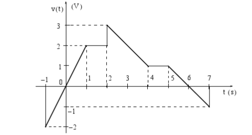

# Lab 1: Elementary Signals

## Keeping Lab Records

The lab component will be assessed based on a portfolio of the MATLAB scripts, Simulink models and publishable MATLAB Live Scripts. You should therefore aim to keep all the files from each lab session in a suitable folder in your workspace on the `p:\` drive. I would suggest a structure like **eg-247-textbook\portfolio\lab01** which matches the layout of the files on this GitHub repository.

One elegant way to do this would be to fork this GitHub repository ([cpjobling/eg-247-textbook](https://github.com/cpjobling/eg-247-textbook)) and then build on from there, but that is not necessary.

If you do not use GitHub as the master repository of your portfolio, please ensure that you backup your work files regularly. You will be required to submit some or all of them for assessment.

## Preamble to this Lab

### Associated Class Notes

This lab supports the materials covered in [Chapter 2 Elementary Signals](https://cpjobling.github.io/eg-247-textbook/elementary_signals/index) of the course notes. You may wish to refer to the Worksheets [worksheet 2](https://cpjobling.github.io/eg-247-textbook/introduction/worksheet2) and [worksheet 3](https://cpjobling.github.io/eg-247-textbook/introduction/worksheet3) for additional examples to try. 

### Other formats

This document is available in [HTML](https://cpjobling.github.io/eg-247-textbook/labs/lab01/index) format for online viewing and as [PDF](https://cpjobling.github.io/eg-247-textbook/labs/lab01/lab01.pdf) for printing.

### Acknowledgement

These examples have been adapted from Chapter 1 of
[Stephen Karris, Signals and Systems : With MATLAB
Computing and Simulink Modeling (5th Edition)](http://site.ebrary.com/lib/swansea/docDetail.action?docID=10547416)

## Aims

The purposes of this laboratory are to

1. Explore the properties of the unit step and Dirac delta functions using the analysis and plotting tools  provided by Matlab.
1. Synthesise a generalised signal in Simulink and plot it and its derivative.

This will introduce the symbolic toolbox and the `heaviside`, `delta` and `ezplot` functions provided by MATLAB  and the *signal design block*, *multiplexer*, *scope* and *derivative* blocks provided by Simulink for the simulation of continuous time signals and systems.

We will also demonstrate the Live Script feature provided by Matlab that will be useful for recording lab results for this module.

## Set up

Right click to save the file [elem_sigs.m](elem_sigs.m) as `elem_sigs.m` to your lab folder. Open the file from the file browser in MATLAB as a Live Script file.

Here is a [short video](https://youtu.be/xwrZAE0D6cY), illustrating how to do this.

## Lab Exercise 1.1

For Lab Exercise 1 you are required to complete parts 1 to 2 of the provided script (1 mark).

## Lab Exercise 1.2

For Lab Exercise 2 you are required to complete parts 3 to 5 of the provided script (2 marks).

## Mini Project 1

Work through the procedures given between [pages 1-18 and 1-19 of the text book](https://ebookcentral.proquest.com/lib/swansea-ebooks/reader.action?ppg=34&docID=3384197&tm=1518436444996) to construct the piecewise signal generator first shown in [Figure 1.21](https://ebookcentral.proquest.com/lib/swansea-ebooks/reader.action?ppg=31&docID=3384197&tm=1518436492450) inside Simulink. 

*Signal to be synthesised (Reproduction of Fig 1.21 of Karris)*

Connect the signal up a derivative block and scope as shown in Figure 1.24 and simulate the system. Verify the result illustrated in Figures 1.23, 1.25 and 1.26. Store the Simulink model as ``signal.slx`` in your portfolio for later assessment. 

**Note**: you will need to adjust the Simulation parameters in Simulink in orer to allow the simulation to run from a time earlier than -1 seconds.

(2 marks)

## What to Hand In

1. For the lab exercises, you should attach your completed version of the Live Script file `elem_signals.mlx`.
1. For the Miniproject the Simulink model of the piecewise linear signal `signal.slx`.

You should attach the files you wish to claim for to the Lab 1 submission page in OneNote, complete the claim form and hand-in your assignment through Teams.

## Claim

Up to three marks can be claimed according to how many of parts 1-5 in the lab exercises have been completed.
The mini project is worth an additional 2 marks.

The deadline for claims and submission is **Midnight, 22nd February**.

See [Assessment and Feedback: Labwork Assessment](https://docs.google.com/spreadsheets/d/1U-O2hu_Th369EHp6mdc1_j_7ARew2WosE93cjsW012c/edit?usp=sharing) for a detailed marking scheme.

## Doing More

If you have time remaining, you may wish to confirm some of the results covered in class from [worksheet 2](https://cpjobling.github.io/eg-247-textbook/worksheets/worksheet2) and [worksheet 3](https://cpjobling.github.io/eg-247-textbook/worksheets/worksheet3). You can also work through Appendix A of the textbook: that chapter introduces Matlab in a way that matches the presentation in the rest of the book. There are also additional tutorial and video introductions to *MATLAB*, *Simulink* and the *Signal Processing Toolbox* in the **Getting Started with Matlab** folder in the Labs section of the Blackboard site for EG-247.
