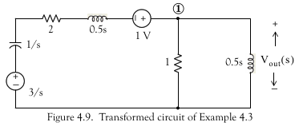
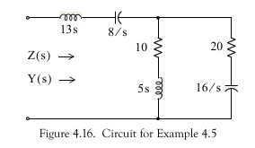

# Lab 3: Laplace Transforms and Transfer Functions for Circuit Analysis

## Preamble

### Associated Class Notes

This lab supports the materials covered in [Chapter 3.3](https://cpjobling.github.io/eg-247-textbook/laplace_transform/3/circuit_analysis) and [Chapter 3.4](https://cpjobling.github.io/eg-247-textbook/laplace_transform/4/transfer_functions) of the course notes. You may wish to refer to the Worksheets [worksheet 6](https://cpjobling.github.io/eg-247-textbook/laplace_transform/3/worksheet6) and [worksheet 7](https://cpjobling.github.io/eg-247-textbook/laplace_transform/4/worksheet7) for additional examples to try. 

### Other formats

This document is available in [HTML](https://cpjobling.github.io/eg-247-textbook/labs/lab03/index) format for online viewing [PDF](https://cpjobling.github.io/eg-247-textbook/labs/lab03/lab03.pdf) for printing.

### Acknowledgements
These examples have been adapted from Chapter 4 of 
[Stephen Karris, Signals and Systems : With MATLAB Computing and Simulink Modeling (5th Edition)](http://site.ebrary.com/lib/swansea/docDetail.action?docID=10547416).

## Tutorial: Defining Transfer Functions in Matlab (not assessed)

The linked m-File is a short tutorial introduction to the definition of transfer functions in Matlab. It introduces the Linear Time Invariant (LTI) block and shows how it can be used in analysis. Download, publish and read the file and use it as a reference for later labs.

Linked m-file: [tf_matlab.m](tf_matlab.m).

## Lab Exercise 4

Download the linked script file for the Solution for Example 3 from Week 3. 
This presents part of the solution to Textbook Example 4.3.

Linked script file [solution3.m](solution3.m)

Starting from the simplified circuit (Fig. 4.9 from [Karris](https://ebookcentral.proquest.com/lib/swansea-ebooks/reader.action?docID=3384197&ppg=101#ppg=101), 2012: p4-5):

1. Define equation 4.5 in MATLAB:

    ``
    eq45 = (Vout - 1 - 3/s)/(1/s + 2 + s/2) + Vout/1 + Vout/(s/2) == 0
    ``

    Now use  `Vout = solve(eq45,Vout)` function to confirm Equation 4.6
    
    $$V_{\mathrm out}(s) = \frac{2s(s+3)}{s^3+8s^2+10s+4}.$$
2. Use `roots` to find the factors of the denominator $$s^3+8s^2+10s+4$$ and expand the terms with complex roots to find the quadratic factor.
3. Use the inverse Laplace Transform on the rational polynomial with real and quadratic factors to determine the symbolic expression `vout` as a function of time.
4. Verify that the response is $$v_{\mathrm out}(t) = \left(1.36e^{-6.57t}+0.64e^{-0.715t}\cos 0.316t -1.84e^{-0.715t}\sin 0.316t\right)u_0(t)$$
4. Use `ezplot` to plot this result.
5. Compare your answer with the numerical solution given by the script.

Save your solution as a file with the name `ex4`.

## Lab Exercise 5: Problem Solving in Matlab

Choose one of the Problems Q1-Q3 from Section 4.7 of Karris 2012 (page 4-21) and use MATLAB to adapt the methods used to solve the problem in Lab Exercise 4 to determine the required solution.

Save your chosen solution as a file with the name `ex5`.

## Lab Exercise 6: Complex Impedance and Admittance

The linked file solves Example 4.5 from Karris 2012 (Example 5 in the notes). The solution concerns the calculation of the Complex Impedance and Admittance of the Circuit shown in Figure 4.16.

Linked file: [solution5.m](solution5.m).

Download the file into MATLAB and use it to verify the equation for the circuit impedance $Z(s)$ given in the notes and the text. Extend it to calculate the admittance $Y(s)$.

Use the same technique to solve Q4 from Section 4.7 (Exercises) of Karris (p. 4-21).

Save your solution to a file with the name `ex6`.

## Mini Project 2: Transfer Functions

Download the linked Matlab script which computes the solution to Example 4.7 
from Karris (2007) (Example 7 from the notes). This script computes the 
transfer function of the Op-Amp circuit shown below:

Linked script file: [solution7.m](solution7.m)

In the original example:

R1 = 20 kOhm

R2 = 40 kOhm

R3 = 50 kOhm

C1 = 25 nF

C2 = 10 nF

Use your student number to give a different set of component values whiles maintaining the relative sizes.

For example if your number was 876543 you might use:

R1 = **8**0 kOhm

R2 = **7**0 kOhm

R3 = **6**0 kOhm

C1 = **54** nF

C2 = **3**0 nF

If your student number contains 0s, you should substitute a digit if your choice.
You may find `doc` or `help` and the symbolic toolbox function ``sym2poly`` useful.

To Do: save a copy of `solution7.m` file as `proj3`. Adapt the script to repeat the computation
using component values based on your student number. Then:

1. compute and plot the phase response of Gs - see function `angle`
2. make a transfer function LTI object `Gs2 = tf(numG,denG)`
3. Compare frequency response with result of `bode(Gs2)`
4. Plot the pole-zero map of `Gs2` using the `pzmap` function.
5. Plot the step response of `Gs2` using the `step` function.
6. Compute and plot the response of `Gs2` to the sinusoid using the `lsim` function.
7. Repeat the simulation of the sinsoidal response in Simulink - save model as `proj2.slx`.

Save your solution as `proj2`.

## What to hand in

You should attach your modified version of the file `proj2` along with the Simulink model plus any additional scripts that you wish to claim for to the Lab 3 submission page in OneNote. Complete the claim form and hand-in your assignment through Teams.

You will find it easiest to audit your completion of these exercises by opening the provided `*.m` files as Live Script (`.mlx`) files and saving them in this format.

## Claim

Up to 3 marks can be claimed for the mini project and up to 2 marks more depending on how much of Exercises 5-6 you have completed.

See [Assessment and Feedback: Labwork Assessment](https://docs.google.com/spreadsheets/d/1U-O2hu_Th369EHp6mdc1_j_7ARew2WosE93cjsW012c/edit?usp=sharing) for a detailed marking scheme.

The deadline for claims and submission is **Midnight, 8th March**.
