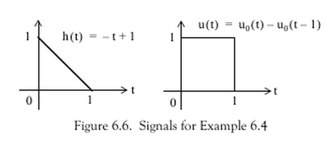
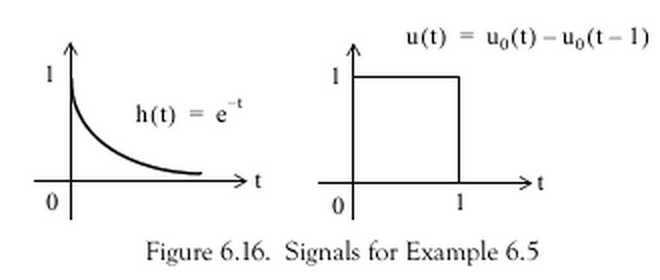
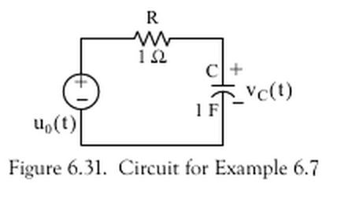

# Lab 4: Time Domain Convolution

## Preamble

### Associated Class Notes

This lab supports the materials covered in [Chapter 3.5 The Impulse Response and Convolution](https://cpjobling.github.io/eg-247-textbook/laplace_transform/5/convolution) of the course notes. You may wish to refer to [worksheet 8](https://cpjobling.github.io/eg-247-textbook/worksheets/worksheet8) for additional examples to try. 

### Other formats

This document is available in [HTML](https://cpjobling.github.io/eg-247-textbook/labs/lab04/index) format for online viewing [PDF](https://cpjobling.github.io/eg-247-textbook/labs/lab04/lab04.pdf) for printing.

### Acknowledgements

These examples have been adapted from Chapter 6 of <a href="http://site.ebrary.com/lib/swansea/docDetail.action?docID=10547416" target="_blank">Stephen Karris, Signals and Systems : With MATLAB Computing and Simulink Modeling (5th Edition)</a>

## Matlab/Simulink Concepts Introduced

In this lab you will:

* Explore convolution with the aid of an interactive MATLAB "app"
* Use the `int` and `heaviside` functions from the **Symbolic Toolbox** to perform symbolic computation of convolution integrals.
* Use `laplace` and `ilaplace` to solve convolution problems.
* Use `ezplot` to plot symbolic functions.

## Preparation

Before we start today's lab you will need to download and install the <a href="https://github.com/cpjobling/eg-247-textbook/blob/master/content/laplace_transform/matlab/convolution_demo/convolutiondemo.m" target="_blank">Graphical demonstration of convolution app</a> from the GitHub respository for this module.

To install, right-click button of link as appropriate and save as to your `lab04` folder. 

Open and run `convolutiondemo.m`.

If MATLAB issues a message about the need to change the working directory or add a folder to the MATLAB path. Accept the choice given.

## Lab Exercise 7: Graphical Demonstration of Convolution

In this lab exercise we will use the `convolutiondemo` app demonstrated in class as an aid to understanding and setting up the convolution integral for various systems including the step-response of an RL circuit.

### Part 1

Set up the `convolutiondemo` app as described in the notes for the computation of the Convolution Integral for Example 6.4 from the textbook illustrated below. (Refer to Example 2 in [the notes](https://cpjobling.github.io/eg-247-textbook/laplace_transform/5/convolution) for the MATLAB settings).

Use the tool to confirm the convolution result given by this Matlab script: [exercise7.m](exercise7.m).

### Part 2

Taking the script [exercise7.m](exercise7.m) as a model. Use the `convolutiondemo` tool as an aid to defining the integration limits needed to find and plot the convolution integral for the example shown below (Example 6.5 from the textbook).

### Part 3

Repeat the procedure for example 6.6 from the textbook.

### Part 4

Adapt your procedure to determine the step response of the RC circuit given as Example 6.7 in the textbook.

Note, if you wish, Parts 2 to 5 can be done in the same Live Script file with the exercises separated by sections. Don't forget to add explanatory text to document your work.

## Lab Exercise 8: Using Laplace to Solve Convolution Problems

In this lab exercise we will demonstrate that time-convolution of a system response can be solved in the complex frequency domain using Laplace and Inverse Laplace transforms.

* Use the inverse Laplace transform function `ilaplace` to solve the step response of the RC circuit given in exercise 10 without convolution. You will need the Laplace transform of the circuit's impulse response $h(t)$ and the unit step $u_0(t)$ (MATLAB `heaviside`).
* Plot the result using `ezplot`
* Confirm the result with a Simulink simulation

## What to hand in

You should attach your modified versions of the example file as a single Live Script or separate scripts to the Lab 4 submission page in OneNote. Marks will be awarded according to how many of Exercises 7 (Parts 2-4) and 8 have been completed. Name each solution according to the exercise and part number: e.g. Exercise 7 scripts should be named `ex7_2`, `ex7_3`,... , `ex8` etc. Use the same naming scheme for any Simulink models submitted for assessment.

If you wish, you can submit all parts of Exercise 7 in a single Live Script file (suggest `ex7.mlx`) providing that each part is separated by properly titled sections. 

Remember, whichever method you use, you should ensure that you use the Live Script editor's text features to add explanatory text to your MATLAB code. 

When you have finished attaching your work, complete the claim form and turn-in your assignment through Teams.

## Claim

Up to 2 marks can be claimed if you complete Part 2 of Exercise 7, an addition 2 marks for is available for Parts 3 and 4 and 1 additional mark is available for completing Lab Exercise 8.

See [Assessment and Feedback: Labwork Assessment](https://docs.google.com/spreadsheets/d/1U-O2hu_Th369EHp6mdc1_j_7ARew2WosE93cjsW012c/edit?usp=sharing) for a detailed marking scheme.

The deadline for claims and submission is **Midnight, 15th March**.
