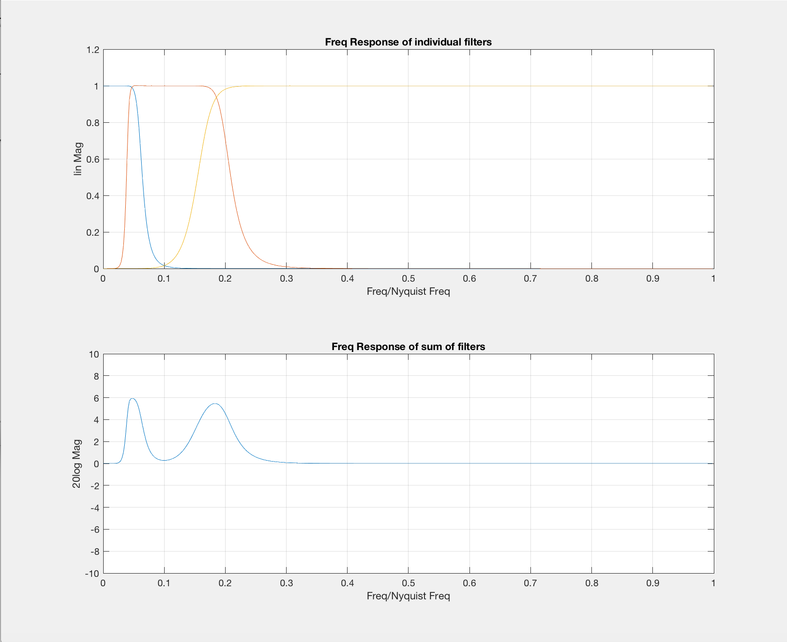
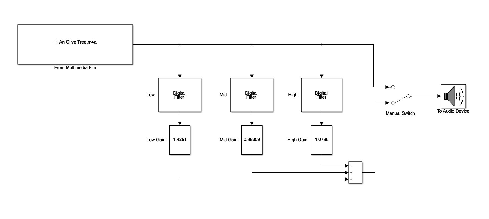

# Project - Design and Implementation of a 10-band Graphic Equaliser

## Aims

The goal of this project is to design a 10-band graphic equaliser and then to simulate it in Simulink to check the design.

These papers: Bohn and Pennington (1987) and Bohn (2008) may help to set the scene and perform the necessary calculations needed.

MATLAB can be employed to design the required filters and then Simulink can be used to implement the graphic equaliser in real time. Most commercial equalisers use either 1/3 octave or 2/3 octave bandpass filters but to keep this from becoming too large we will employ one octave bandpass filters.

## Assessment criteria

The project is worth 20 marks. Marks will be deducted if your submission violates the specification in any way or if I cannot test your submission because the model is incorrect, the gain settings are incorrect, the music file needed is not provided, etc.

Detailed marking criteria for this and the other labs and the project are given in the linked [Assessment Criteria](https://docs.google.com/spreadsheets/d/1EQzwSfGMdw8oiQds4bUR8sZTCgb2lMvcJHjmea-8hW4/edit?usp=sharing) [Google sheet].

## Setup

### Before you start

If you haven't already, create a suitable folder structure on your file-store for your labs. 

I suggest

```
P:\workspace
    signals-and-systems-lab
	    lab01
		lab02
		lab03
        lab04
        lab05
        lab06
        lab07
        project
```

Use folder `p:\workspace\signals-and-systems-lab\project` for this lab.

## Specification

The following are the design specifications for the equaliser:  

* Employing MATLAB, design 10 different bandpass filters with centre frequencies of 31.5 Hz, 63 Hz, 125 Hz, 250 Hz, 500 Hz, 1000 Hz, 2000 Hz, 4000 Hz, 8000 Hz, and 16000 Hz. These centre frequencies correspond to the ISO (International Standards Organization) standard for graphic equaliser centre frequencies.
* The bandwidth of each filter is the frequency difference 
$$\Delta f = f_2 - f_1,$$
where $f_1$ and $f_2$ correspond to the frequencies where the gain is 3 dB less than the maximum gain at the centre frequency. It also is necessary to choose $f_1$ and $f_2$ such that the centre frequency, $f_c$, is equal to the geometric mean of $f_1$ and $f_2$, i.e.
$$f_c = (f_1f_2)^{1/2}.$$
* You also have to choose the bandwidth of each filter so that you get a flat frequency response when all filter gains are equal and added together. See the figure below for a simple 3-band EQ example.

*Figure 1 – The magnitude response functions of a 3-band graphic EQ. 8<sup>th</sup> order Butterworth filters are employed; low-pass, band-pass, and high pass and the bandwidths were chosen to give a fairly flat response when all of the filters are added together, as shown in the bottom plot of Figure 1*. This plot was generated by this file: [Three_Band_EQ.m](Three_Band_EQ.m)

Thus, your first task is to find the coefficients of a set of digital filters that satisfy these constraints. We will use Butterworth filters; however you are free to choose the order of the filters. The MATLAB help file for the Butterworth filter is the following:

```
[B,A] = butter(N,Wn) designs an Nth order lowpass digital Butterworth filter and returns the filter coefficients in 
length N+1 vectors B (numerator) and A (denominator). The coefficients are listed in descending powers of z. The 
cutoff frequency Wn must be 0.0 < Wn < 1.0, with 1.0 corresponding to half the sample rate.   

If Wn is a two-‐element vector, Wn = [W1 W2], butter returns an order 2N bandpass filter with passband 
W1 < W < W2.   

[B,A] = butter(N,Wn,'high') designs a high-pass filter. 
[B,A] = butter(N,Wn,'low') designs a low-pass filter. 
[B,A] = butter(N,Wn,'stop') is a bandstop filter if Wn = [W1 W2].   
```

## Method

* Write a MATLAB Live Script to compute the set of filter coefficients and plot the combination (sum) of all filter frequency responses, as shown in Figure 1. Note that you can use the ‘`freqz`’ command to easily find the frequency response of a filter defined by the filter coefficient arrays B and A. Your goal is to achieve as flat of a frequency response as you can when all the frequency response of all filters are added: ± 1 dB is a good goal. Remember that the centre frequency of each filter must be fixed to one of the ten values given above and the upper and lower cutoff frequencies $f_2$ & $f_1$ must satisfy
$$f_c = (f_1f_2)^{1/2}.$$ 
* Your goal is to find the $\Delta f$ value for each filter that achieves a flat frequency response when all filters are combined with equal weights. [*Hint*: the filters should all be constant $Q$, where 
$$Q = \frac{f_c}{(f_2 - f_1)}.$$
Once you find the right value for $Q$, all filters should have the same $Q$.]

A simplified 3-band graphic equalizer is shown below in Figure 2, where the filters are in parallel and each one is followed by a gain (using the MATLAB slider gain block). Your mixer will have 10 filters in parallel.


Figure 2 – Block diagram of the 3 band graphic equalizer. The Simulink Model that produced this image is: [Three_Band_EQ_Model.slx](Three_Band_EQ_Model.slx).

* We would like to be able to adjust the gain of each band by ± 12 dB. Remember that 6dB corresponds to approximately a factor of 2x, so 12 dB is about 4x. So +12 dB is like multiplying by 4 and -12 dB is like multiplying by 1/4. Use these values as the limits for the slider gain blocks.

One final note: The “From Multimedia File” and “To Audio Device” blocks can be found in the DSP Toolbox.

## What to hand in

### Claim

You should tell me the percentage confidence in your design.

### Submission

You should submit the following to the **Project: A Graphic Equalizer** Assignment on Canvas.

1. Complete the labwork self-assessment claim form and declaration.
1. Submit the Simulink model of your graphical equalizer with the gains set to some approximation of your student number along with a copy of the music file you use to test the graphic equalizer and a diagram similar to Figure 1 that shows the flat frequency response of your design.

### Deadline

The deadline for claims and submission is **Midnight, 24th April**

## References

Bohn, Dennis and Pennington Terry, 1987. Constant Q Graphic Equalizers, Rane Note 101, Rane Corporation. Online: [http://www.rane.com/note101.html](http://www.rane.com/note101.html).

Bohn, Dennis, 2008. Bandwidth in Octaves Versus Q in Bandpass Filters, Rane Note 170, Rane Corporation. Online: [http://www.rane.com/note170.html](http://www.rane.com/note170.html).
