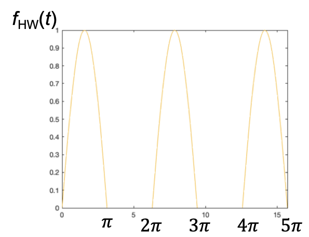

---
redirect_from:
  - "/laplace-transform/1/worksheet4"
interact_link: content/laplace_transform/1/worksheet4.ipynb
title: 'Worksheet 4'
prev_page:
  url: /elementary_signals/worksheet3
  title: 'Worksheet 3'
next_page:
  url: /labs/index
  title: 'Laboratory Exercises'
comment: "***PROGRAMMATICALLY GENERATED, DO NOT EDIT. SEE ORIGINAL FILES IN /content***"
---

**Lecturer**

Set up MATLAB


{:.input_area}
```matlab
clear all
format compact
```


# Worksheet 4

## To accompany Chapter 3.1 Laplace Transform

We will step through this worksheet in class. 

You are expected to have at least watched the video presentation of [Chapter 3.1](https://cpjobling.github.io/eg-247-textbook/laplace_transform/1/laplace) of the [notes](https://cpjobling.github.io/eg-247-textbook) before coming to class. If you haven't watch it afterwards!

## TurningPoint Mobile Polling Setup

We will be using TurningPoint mobile response system polling in this session.

There are two ways to participate:

### 1. Use a web browser

This option always works providing you have a mobile web browser.

Browse to: [https://ttpoll.eu](https://ttpoll.eu). 


https://ttpoll.eu

### 2. Install and open the TurningPoint app

Browse to: [TurningPoint
app](https://www.turningtechnologies.com/turningpoint-app/)


https://goo.gl/MEjxu7

Use the links to the App stores at the bottom of that page or follow these links: [App Store](https://itunes.apple.com/us/app/responseware/id300028504?mt=8), [Google Play](https://play.google.com/store/apps/details?id=com.turningTech.Responseware&feature=search_result#?t=W251bGwsMSwyLDEsImNvbS50dXJuaW5nVGVjaC5SZXNwb25zZXdhcmUiXQ..).

When prompted: enter the **session ID**

### Today's Session ID
<pre>


</pre>
<div style="font-size: 32pt; font-face: bold;">EG2470002</div>
<pre>


</pre>

### Assign yourself to a group by table

There should be a card with a **group name** on your table.

Please use your TurningPoint app or the TurningPoint web app to assign yourself to your table's group name.

#### -> Launch Poll

### Icebreaker Questions

#### -> Launch Poll

### End of setup

## Laplace transforms of common waveforms

We will work through a few of the following on the board in class

* Pulse
* Linear segment
* Triangular waveform
* Rectangular periodic waveform (square wave)
* Half rectified sine wave

### Pulse

Compute the Laplace transform of the pulse shown in the figure.


<pre style="border: 2px solid blue">


</pre>

### Line segment

Compute the Laplace transform of the line segment shown below.


</pre>

### Triangular Pulse

Compute the Laplace transform of the triangular pulse shown below


<pre style="border: 2px solid blue">


</pre>

### Square Wave

Compute the Laplace transform of the periodic function shown below.


<pre style="border: 2px solid blue">


</pre>

### Half-rectified Sinewave

Compute the Laplace Transform of the half-rectified sine wave shown below.



<pre style="border: 2px solid blue">


</pre>

## Homework

Attempt at least one of the end-of-chapter exercises from each question 1-7 of [Section 2.7 of Karris](https://ebookcentral.proquest.com/lib/swansea-ebooks/reader.action?docID=3384197&ppg=75#ppg=71). Don't look at the answers until you have attempted the problems.

If we have time, I will work through one or two of these in class.

## Answers to in-class problems

1. $$Au_0(t)-Au_0(t-a)\Leftrightarrow \frac{A\left(1-e^{-as}\right)}{s}.$$

2. $$(t-1)u_0(t-1)\Leftrightarrow \frac{e^{-s}}{s}.$$

3. $$f_T(t)\Leftrightarrow \frac{\left(1-e^{-s}\right)^2}{s^2}.$$

4. $$f_R(t)\Leftrightarrow \frac{A\tanh \left(\frac{As}{2}\right)}{s}.$$

5. $$f_HW(t) \Leftrightarrow \frac{1}{\left(s^2 + 1\right)\left(1-e^{\pi s}\right)}.$$
