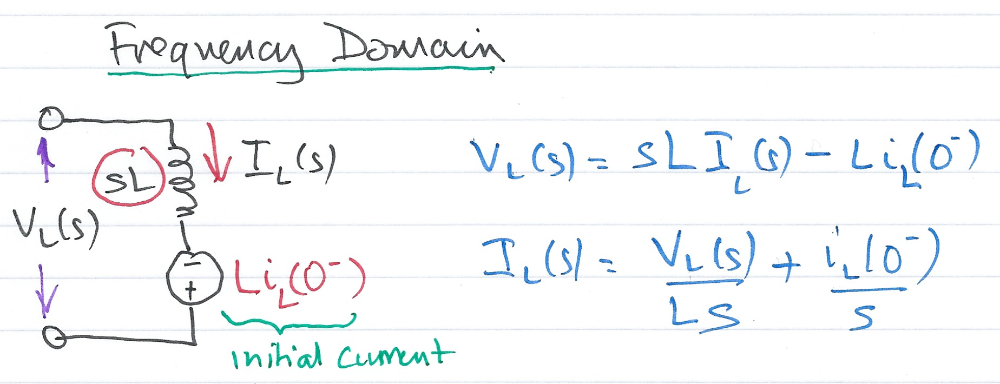
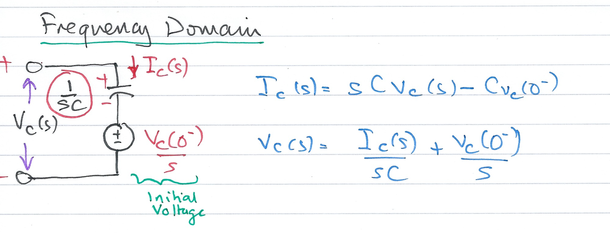

---
redirect_from:
  - "/laplace-transform/3/circuit-analysis"
interact_link: content/laplace_transform/3/circuit_analysis.ipynb
title: 'Using Laplace Transforms for Circuit Analysis'
prev_page:
  url: /laplace_transform/2/inverse_laplace
  title: 'The Inverse Laplace Transform'
next_page:
  url: /laplace_transform/4/transfer_functions
  title: 'Transfer Functions'
comment: "***PROGRAMMATICALLY GENERATED, DO NOT EDIT. SEE ORIGINAL FILES IN /content***"
---

# Using Laplace Transforms for Circuit Analysis

## First Hour's Agenda

We look at applications of the Laplace Transform for

* Circuit transformation from Time to Complex Frequency

* Complex impedance

* Complex admittance

## Circuit Transformation from Time to Complex Frequency

### Resistive Network - Time Domain

### Resistive Network - Complex Frequency Domain

### Inductive Network - Time Domain

### Inductive Network - Complex Frequency Domain

### Capacitive Network - Time Domain

### Capacitive Network - Complex Frequency Domain

### Examples

We will work through these in class. See [worksheet6](worksheet6).

## Complex Impedance Z(s)

Consider the $s$-domain RLC series circuit, wehere the initial conditions are assumed to be zero.

For this circuit, the sum

$$R + sL + \frac{1}{sC}$$ 

represents that total opposition to current flow. Then,

$$I(s) = \frac{V_s(s)}{R + sL + 1/(sC)}$$

and defining the ratio $V_s(s)/I(s)$ as $Z(s)$, we obtain

$$Z(s) = \frac{V_s(s)}{I(s)} = R + sL + \frac{1}{sC}$$

The $s$-domain current $I(s)$ can be found from 

$$I(s) = \frac{V_s(s)}{Z(s)}$$

where

$$Z(s) = R + sL + \frac{1}{sC}.$$

Since $s = \sigma + j\omega$ is a complex number, $Z(s)$ is also complex and is known as the *complex input impedance* of this RLC series circuit.

## Complex Admittance Y(s)

Consider the $s$-domain GLC parallel circuit shown below where the initial conditions are zero.

For this circuit

$$GV(s)+ \frac{1}{sL}V(s) + sCV(s) = I_s(s)$$

$$\left(G+ \frac{1}{sL} + sC\right)V(s) = I_s(s)$$

Defining the ratio $I_s(s)/V(s)$ as $Y(s)$ we obtain

$$Y(s)=\frac{I_s(s)}{V(s)} = G+ \frac{1}{sL} + sC = \frac{1}{Z(s)}$$

The $s$-domain voltage $V(s)$ can be found from 

$$V(s) = \frac{I_s(s)}{Y(s)}$$

where

$$Y(s) = G + \frac{1}{sL} + sC.$$

$Y(s)$ is complex and is known as the *complex input admittance* of this GLC parallel circuit.
