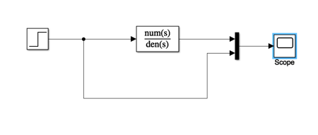

---
redirect_from:
  - "/laplace-transform/4/transfer-functions"
interact_link: content/laplace_transform/4/transfer_functions.ipynb
title: 'Transfer Functions'
prev_page:
  url: /laplace_transform/3/circuit_analysis
  title: 'Using Laplace Transforms for Circuit Analysis'
next_page:
  url: /laplace_transform/5/convolution
  title: 'The Impulse Response and Convolution'
comment: "***PROGRAMMATICALLY GENERATED, DO NOT EDIT. SEE ORIGINAL FILES IN /content***"
---

# Transfer Functions

## Second Hour's Agenda

* Transfer Functions

* A Couple of Examples

* Circuit Analysis Using MATLAB LTI Transfer Function Block

* Circuit Simulation Using Simulink Transfer Function Block


{:.input_area}
```matlab
% Matlab setup
clear all
format compact
```


## Transfer Functions for Circuits

When doing circuit analysis with components defined in the complex frequency domain, the ratio of the output voltage $V_{\mathrm{out}}(s)$ ro the input voltage $V_{\mathrm{in}}(s)$ *under zero initial conditions* is of great interest. This ratio is known as the *voltage transfer function* denoted $G_v(s)$:

$$G_v(s) = \frac{V_{\mathrm{out}}(s)}{V_{\mathrm{in}}(s)}$$

Similarly, the ratio of the output current $I_{\mathrm{out}}(s)$ to the input current $I_{\mathrm{in}}(s)$ *under zero initial conditions*, is called the *cuurent transfer function* denoted $G_i(s)$:

$$G_i(s) = \frac{I_{\mathrm{out}}(s)}{I_{\mathrm{in}}(s)}$$

In practice, the current transfer function is rarely used, so we will use the voltage transfer function denoted:

$$G(s) = \frac{V_{\mathrm{out}}(s)}{V_{\mathrm{in}}(s)}$$

## Examples

See [worksheet7](worksheet7) for the worked solutions to the examples. We will work through these in class. Here' I'll demonstrate the MATLAB solutions.

### Example 6

Derive an expression for the transfer function $G(s)$ for the circuit below. In this circuit $R_g$ represents the internal resistance of the applied (voltage) source $v_s$, and $R_L$ represents the resistance of the load that consists of $R_L$, $L$ and $C$.


### Sketch of Solution

* Replace $v_s(t)$, $R_g$, $R_L$, $L$ and $C$ by their transformed (*complex frequency*) equivalents: $V_s(s)$, $R_g$, $R_L$, $sL$ and $1/(sC)$
* Use the *Voltage Divider Rule* to determine $V_\mathrm{out}(s)$ as a function of $V_s(s)$ 
* Form $G(s)$ by writing down the ratio $V_\mathrm{out}(s)/V_s(s)$

### Worked solution.

Pencast: [ex6.pdf](../worked_examples/ex6.pdf) - open in Adobe Acrobat Reader.

### Answer

$$G(s) = \frac{V_\mathrm{out}(s)}{V_s(s)} = \frac{R_L + sL + 1/sC}{R_g + R_L + sL + 1/sC}.$$

### Example 7

Compute the transfer function for the op-amp circuit shown below in terms of the circuit constants $R_1$, $R_2$, $R_3$, $C_1$ and $C_2$. Then replace the complex variable $s$ with $j\omega$, and the circuit constants with their numerical values and plot the magnitude

$$\left|G(j\omega)\right| = \frac{\left|V_{\mathrm{out}}(j\omega)\right|}{\left|V_{\mathrm{in}}(j\omega)\right|}$$

versus radian frequency $\omega$ rad/s.


### Sketch of Solution

* Replace the components and voltages in the circuit diagram with their complex frequency equivalents
* Use nodal analysis to determine the voltages at the nodes either side of the 50K resistor $R_3$
* Note that the voltage at the input to the op-amp is a virtual ground
* Solve for $V_{\mathrm{out}}(s)$ as a function of $V_{\mathrm{in}}(s)$
* Form the reciprocal $G(s) = V_{\mathrm{out}}(s)/V_{\mathrm{in}}(s)$
* Use MATLAB to calculate the component values, then replace $s$ by $j\omega$.
* Plot

    $$\left|G(j\omega)\right|$$

  on log-linear "paper".

### Worked solution.

Pencast: [ex7.pdf](../worked_examples/ex7.pdf) - open in Adobe Acrobat Reader.

### Answer

$$G(s) = \frac{V_\mathrm{out}(s)}{V_\mathrm{in}(s)} = \frac{-1}{R_1\left(\left(1/R_1 + 1/R_2 + 1/R_3 + sC_1\right)\left(sC_2R_3\right)+1/R_2\right)}.$$

### The Matlab Bit

See attached script: [solution7.m](../matlab/solution7.m).

#### Week 3: Solution 7


{:.input_area}
```matlab
syms s;
```


{:.input_area}
```matlab
R1 = 200*10^3; 
R2 = 40*10^3;
R3 = 50*10^3;

C1 = 25*10^(-9);
C2 = 10*10^(-9);
```


{:.input_area}
```matlab
den = R1*((1/R1+ 1/R2 + 1/R3 + s*C1)*(s*R3*C2) + 1/R2);
simplify(den)
```


{:.output .output_stream}
```
ans =
100*s*((7555786372591433*s)/302231454903657293676544 + 1/20000) + 5

```

Result is: `100*s*((7555786372591433*s)/302231454903657293676544 + 1/20000) + 5`

Simplify coefficients of s in denominator


{:.input_area}
```matlab
format long
denG = sym2poly(ans)
```


{:.output .output_stream}
```
denG =
   0.000002500000000   0.005000000000000   5.000000000000000

```


{:.input_area}
```matlab
numG = -1;
```


Plot

For convenience, define coefficients $a$ and $b$:


{:.input_area}
```matlab
a = denG(1);
b = denG(2);
```


{:.input_area}
```matlab
w = 1:10:10000;
```


$$G(j\omega) = \frac{-1}{a\omega^2 - jb\omega + 5}$$


{:.input_area}
```matlab
Gs = -1./(a*w.^2 - j.*b.*w + denG(3));
```


{:.input_area}
```matlab
semilogx(w, abs(Gs))
xlabel('Radian frequency w (rad/s')
ylabel('|Vout/Vin|')
title('Magnitude Vout/Vin vs. Radian Frequency')
grid
```


{:.output .output_png}


## Using Transfer Functions in Matlab for System Analysis

Please use the file [tf_matlab.m](../matlab/tf_matlab.m) to explore the Transfer Function features provide by Matlab. Use the *publish* option to generate a nicely formatted document.

## Using Transfer Functions in Simulink for System Simulation


The Simulink transfer function (**`Transfer Fcn`**) block shown above implements a transfer function representing a general
input output function

$$G(s) = \frac{N(s)}{D(s)}$$

that it is not specific nor restricted to circuit analysis. It can, however be used in modelling and simulation studies. 

### Example

Recast Example 7 as a MATLAB problem using the LTI Transfer Function block. 

For simplicity use parameters $R_1 = R_2 = R_3 = 1\; \Omega$, and $C_1 = C_2 = 1$ F.

Calculate the step response using the LTI functions.

Verify the result with Simulink.

The Matlab solution: [example8.m](../matlab/example8.m)

#### MATLAB Solution
From a previous analysis the transfer function is:

$$G(s) = \frac{V_\mathrm{out}}{V_\mathrm{in}} = \frac{-1}{R_1\left[(1/R_1 + 1/R_2 + 1/R_3 + sC_1)(sR_3C_2) + 1/R_2\right]}$$

so substituting the component values we get:

$$G(s) = \frac{V_{\mathrm{out}}}{V_{\mathrm{in}}} = \frac{-1}{s^2 + 3s + 1}$$

We can find the step response by letting $v_{\mathrm{in}}(t) = u_0(t)$ so that
$V_{\mathrm{in}}(s)=1/s$ then 

$$V_{\mathrm{out}}(s) = \frac{-1}{s^2 + 3s + 1}.\frac{1}{s}$$
 
We can solve this by partial fraction expansion and inverse Laplace transform
as is done in the text book with the help of Matlab's `residue` function.

Here, however we'll use the LTI block that was introduced in the lecture.

Define the circuit as a transfer function


{:.input_area}
```matlab
G = tf([-1],[1 3 1])
```


{:.output .output_stream}
```

G =
 
       -1
  -------------
  s^2 + 3 s + 1
 
Continuous-time transfer function.


```

step response is then:


{:.input_area}
```matlab
step(G)
```


{:.output .output_png}


Simples!

#### Simulink model

See [example_8.slx](../matlab/example_8.slx)


{:.input_area}
```matlab
open example_8
```




Result


Let's go a bit further by finding the frequency response:


{:.input_area}
```matlab
bode(G)
```


{:.output .output_png}


